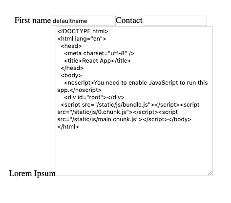

# react_template

### Setup
Clone the project
* `git clone https://github.com/justinckm/react_template.git`
* `yarn install`
* `yarn start`

### Project focus on the following
* hooks
  * useState
  * useEffect
  * useSelector
* state management
  * react hook state
  * react redux
* field validation
* jest
* optional
  * redux asynchronous actions

### Task (1 hour assignment)
1. Create a functional component `PersonalDetails` to display `FirstName` and `Contact`
2. Use React state (hook) to store the `FirstName`
3. Validate that `FirstName` is alphanumeric using regex
4. Use `useEffect` hook to populate the default value of `FirstName` to `defaultName`
5. Use React Redux to store the `Contact`
6. Create a reducer `personalDetailsReducer` to be used with `rootReducer`
7. Use `useSelector` hook to retrieve the redux state
8. Use `useDispatch` hook to dispatch changes to redux store
9. Validate that ContactNumber contains `+` and `numbers` only
10. Create unit test for the validation function

#### Optional
1. Create a functional component `LipsumContent` to display `Lorem Ipsum`
2. Create a reducer for `lipsumContentReducer` to be used with `rootReducer`
3. Retrieve the content from `http://localhost:3000` using `axios` and display in `LipsumContent` when page first load 
